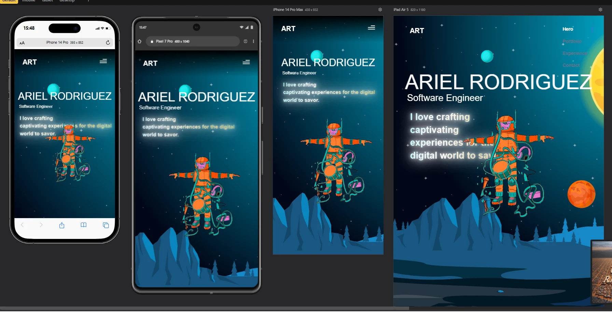
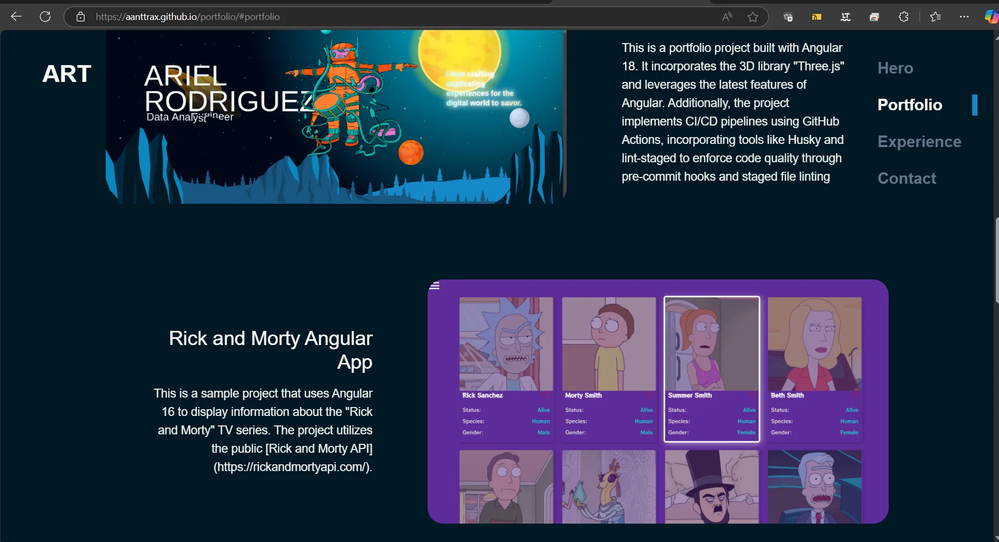
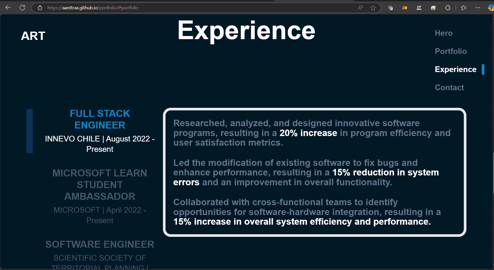

# TaskApp Angular 19.0.2.

<!--  -->

This task project is built with Angular 19 and demonstrates a fully functional task management system with user authentication. Users can create, update, and delete tasks through a modern and intuitive interface, while login and registration features ensure secure access. The project leverages Angular's latest features, such as standalone components and typed forms, alongside Botstrap for responsive and polished UI design.

Additionally, the project integrates CI/CD pipelines using GitHub Actions, automating build, test, and deployment workflows. Code quality is enforced through Husky and lint-staged pre-commit hooks. Deployed on GitHub Pages, this application showcases advanced Angular development practices combined with robust task management and authentication features. Visit the live demo at [Task Site](https://).

## Screenshots

<!--  -->
<!--  -->
<!--  -->

## 🚀 Features

- List of tasks.
- Tasks details.
- Create, Update, Delete tasks.
- Login y Register with validations.

## 📝 Requirements

- [Node.js](https://nodejs.org/) installed on your system.
- [Angular CLI](https://cli.angular.io/) installed globally.

## 🛠️ Installation

Follow these steps to install and run the application:

1.  Clone the repository:

    ```bash
    git clone https://github.com/Aanttrax/task-app.git
    ```

2.  Navigate to the project directory:

    ```bash
    cd task-app
    ```

3.  Install the dependencies:

    ```bash
    npm install
    ```

4.  Start the application:

    ```bash
    npm start
    ```

5.  Open your browser and go to http://localhost:4200/.

## 🤝 Contribution

If you want to contribute to this project, feel free to open issues and submit pull requests.

## 📬 Contact

You can contact the project author at Arielrt20@gmail.com or Arielrt_@hotmail.com

<!-- ng add @ngx-env/builder -->
